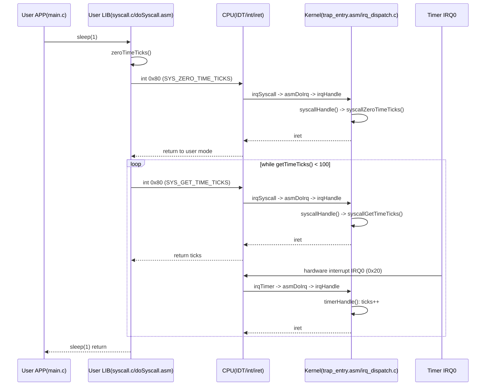

# OS 作业 1 答案

## 第 1 题

题目要求：在 Linux 环境下用 NASM 分别实现 32 位和 64 位版本的 `write`、`sleep`、`exit` 库函数（底层分别封装 `write/select/exit` 系统调用），并在 `mylib.h` 中声明接口，再用它们实现“每隔 1 秒打印一次 `hello world`，共 3 次”的 C 程序。

### 1.1 头文件 `mylib.h`

```c
#ifndef MYLIB_H
#define MYLIB_H

#ifdef __cplusplus
extern "C" {
#endif

long mywrite(int fd, const void *buf, unsigned int count);
int mysleep(unsigned int sec);
void myexit(int status);

#ifdef __cplusplus
}
#endif

#endif
```

### 1.2 C 主程序 `main.c`

```c
#include "mylib.h"

int main(void) {
	static const char msg[] = "hello world\n";
	for (int i = 0; i < 3; i++) {
		mywrite(1, msg, sizeof(msg) - 1);
		mysleep(1);
	}
	myexit(0);
	return 0;
}
```

### 1.3 32 位 NASM 实现 `mylib32.asm`

```asm
[bits 32]
global mywrite
global mysleep
global myexit

section .text

; long mywrite(int fd, const void *buf, unsigned int count)
mywrite:
	push ebp
	mov ebp, esp
	push ebx

	mov eax, 4          ; __NR_write (x86)
	mov ebx, [ebp + 8]  ; fd
	mov ecx, [ebp + 12] ; buf
	mov edx, [ebp + 16] ; count
	int 0x80

	pop ebx
	pop ebp
	ret

; int mysleep(unsigned int sec)
; sleep(sec) -> select(0, NULL, NULL, NULL, &tv)
mysleep:
	push ebp
	mov ebp, esp
	push ebx
	push esi
	push edi

	sub esp, 8
	mov eax, [ebp + 8]
	mov [esp], eax         ; tv_sec
	mov dword [esp + 4], 0 ; tv_usec

	mov eax, 142        ; __NR_select (x86)
	xor ebx, ebx        ; nfds = 0
	xor ecx, ecx        ; readfds = NULL
	xor edx, edx        ; writefds = NULL
	xor esi, esi        ; exceptfds = NULL
	mov edi, esp        ; timeout = &tv
	int 0x80

	add esp, 8
	pop edi
	pop esi
	pop ebx
	pop ebp
	ret

; void myexit(int status)
myexit:
	mov eax, 1          ; __NR_exit (x86)
	mov ebx, [esp + 4]  ; status
	int 0x80
	hlt
```

### 1.4 64 位 NASM 实现 `mylib64.asm`

```asm
[bits 64]
global mywrite
global mysleep
global myexit

section .text

; long mywrite(int fd, const void *buf, unsigned int count)
mywrite:
	mov eax, 1          ; __NR_write (x86_64)
	syscall
	ret

; int mysleep(unsigned int sec)
; sleep(sec) -> select(0, NULL, NULL, NULL, &tv)
mysleep:
	push rbp
	mov rbp, rsp
	sub rsp, 16

	mov [rsp], rdi         ; tv_sec (long)
	mov qword [rsp + 8], 0 ; tv_usec

	mov eax, 23         ; __NR_select (x86_64)
	xor edi, edi        ; nfds
	xor esi, esi        ; readfds
	xor edx, edx        ; writefds
	xor r10d, r10d      ; exceptfds
	lea r8, [rsp]       ; timeout
	syscall

	leave
	ret

; void myexit(int status)
myexit:
	mov eax, 60         ; __NR_exit (x86_64)
	syscall
	hlt
```

### 1.5 编译与运行（含验证输出）

源码目录：`workspace/OS/homework1/q1_src`

#### 64 位版本

```bash
cd /home/kleene/workspace/OS/homework1/q1_src
nasm -f elf64 mylib64.asm -o mylib64.o
gcc -no-pie -O2 main.c mylib64.o -o hello64
./hello64
```

运行输出：

```bash
hello world
hello world
hello world
```

#### 32 位版本

```bash
cd /home/kleene/workspace/OS/homework1/q1_src
nasm -f elf32 mylib32.asm -o mylib32.o
gcc -m32 -no-pie -O2 main.c mylib32.o -o hello32
./hello32
```

运行输出：

```bash
hello world
hello world
hello world
```

如果本机缺少 32 位编译环境，可先安装：

```bash
sudo apt-get update
sudo apt-get install gcc-multilib libc6-dev-i386
```

---

## 第 2 题

问题：是否有必要让程序员了解哪个库函数调用会导致系统调用？

我的结论：有必要，但不需要每个程序员都精确记忆全部细节。

原因：

1. 性能分析需要
- 系统调用会触发用户态到内核态切换，开销明显高于普通函数调用。
- 在高频路径中（如日志、I/O、网络），知道“哪些库函数会进内核”可以减少不必要的 syscall 次数。

2. 正确性与阻塞语义需要
- 很多库函数可能阻塞（如 `read`、`select`、`sleep`），会影响调度和超时行为。
- 不理解背后 syscall 容易导致线程卡住、超时策略失效。

3. 安全与权限边界需要
- 系统调用涉及文件权限、进程权限、资源限制。
- 程序员需要知道“失败发生在库层还是内核层”，便于正确处理错误码（如 `EPERM`、`EINTR`）。

4. 调试与可观测性需要
- 使用 `strace`、`perf`、`ftrace` 时，本质都在观察 syscall。
- 若不了解库函数到 syscall 的映射，定位问题效率会很低。

补充：
- 日常业务开发只需掌握关键路径函数与常见阻塞点。
- 系统编程、性能优化和内核相关开发则需要更深入理解 syscall 细节。

---

## 第 3 题

题目要求：画出 Lab2 中 app 调用 `sleep` 库函数引发系统调用过程的时序图，刻画用户态 app/sleep 库代码和核心态 OS 内核函数执行过程。

### 3.1 时序图（Mermaid）



### 3.2 过程说明（结合 Lab2 代码）

1. `app/main.c` 调用 `sleep(1)`，进入用户态库 `lib/syscall.c`。
2. `sleep` 先调用 `zeroTimeTicks`，通过 `int 0x80` 请求内核把 `ticks` 置零。
3. `sleep` 循环调用 `getTimeTicks`，每次都通过 `int 0x80` 进入内核读取当前 `ticks`。
4. 同时，硬件时钟中断 IRQ0 周期性发生，内核 `timerHandle` 中持续 `ticks++`。
5. 当 `ticks >= 100`（100Hz 定时器下约 1 秒）时，循环结束，`sleep(1)` 返回给 app。

---

## 运行与截图建议

你说“另外我需要运行并截图”，可按以下点位截图（用于作业 PDF）：

1. 64 位编译成功

```bash
cd /home/kleene/workspace/OS/homework1/q1_src
nasm -f elf64 mylib64.asm -o mylib64.o
gcc -no-pie -O2 main.c mylib64.o -o hello64
```

建议截图名：`q1_64_build.png`

2. 64 位运行输出（3 次 hello world）

```bash
./hello64
```

建议截图名：`q1_64_run.png`

3. 32 位编译成功

```bash
nasm -f elf32 mylib32.asm -o mylib32.o
gcc -m32 -no-pie -O2 main.c mylib32.o -o hello32
```

建议截图名：`q1_32_build.png`

4. 32 位运行输出（3 次 hello world）

```bash
./hello32
```

建议截图名：`q1_32_run.png`

5. 第 3 题时序图渲染结果（Obsidian 预览页）

建议截图名：`q3_sequence_diagram.png`

