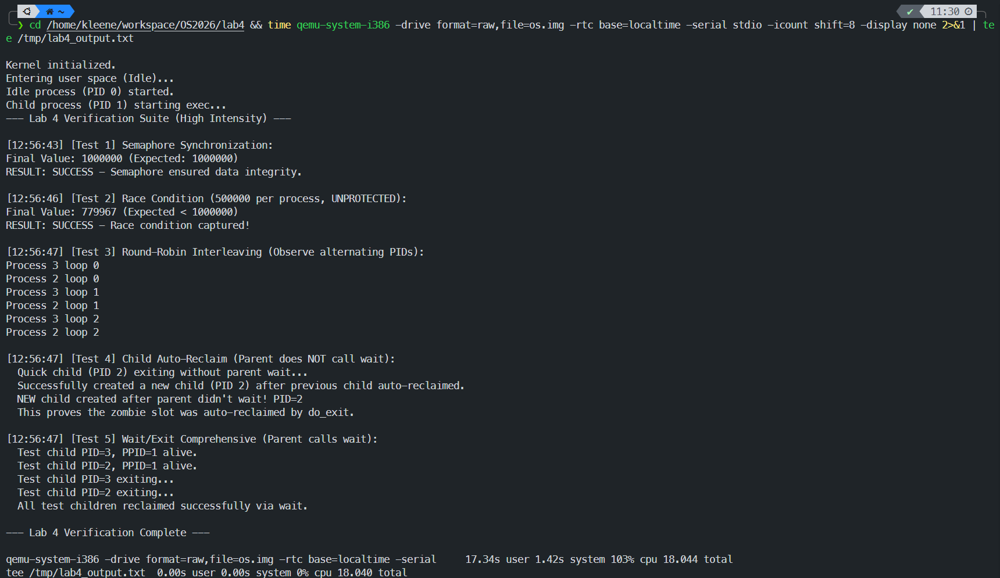
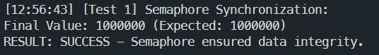
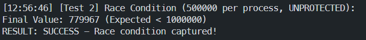
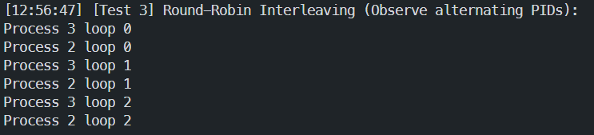
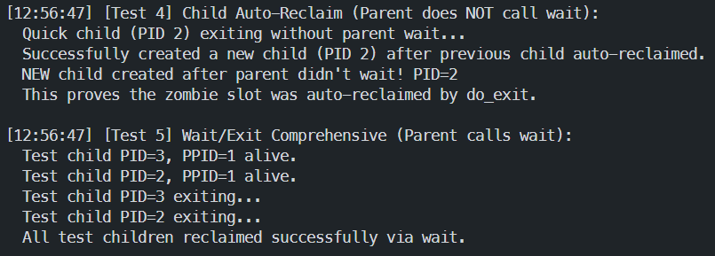

# Lab 4: 进程间通信与同步 — 实验报告

## 一、实验目的

本实验在 Lab 3 多进程并发管理与抢占式调度的基础上，实现以下核心机制：

1. **Wait/Exit 进程回收**：完善 `exit` 系统调用，新增 `wait` 系统调用，实现父子进程间的同步退出与资源回收，解决僵尸进程泄漏问题。
2. **信号量与 PV 操作**：新增 `sem_init`、`sem_destroy`、`sem_wait`、`sem_post` 系统调用，为共享内存的并发访问提供同步原语。
3. **时间片轮转调度**：将 Lab 3 的逆向扫描调度升级为公平的时间片轮转（Round-Robin）抢占式调度。

## 二、实验环境

- **模拟器**：QEMU (qemu-system-i386)，启用 `-icount shift=8` 以便观测数据竞争
- **编译器**：GCC 32-bit (march=i386)，NASM
- **内核架构**：x86 32-bit 保护模式，基于中断门（Interrupt Gate）的系统调用

## 三、核心实现

### 3.1 时间片轮转调度（Round-Robin）

**设计思路**：将 Lab 3 的逆向扫描替换为从当前进程 PID+1 开始的循环扫描（轮转），优先选择用户进程（PID > 0），仅当无用户进程就绪时才回退到 Idle 进程（PID 0）。

```c
void schedule() {
    struct PCB *next = NULL;
    struct PCB *idle_candidate = &pcb[0];
    int found_user = 0;

    // 轮转扫描：从 current->pid + 1 开始
    int start = (current->pid + 1) % MAX_PCB;
    for (int i = 0; i < MAX_PCB; i++) {
        int idx = (start + i) % MAX_PCB;
        if ((pcb[idx].state == RUNNABLE || pcb[idx].state == RUNNING)
            && idx != current->pid) {
            if (idx > 0) {
                next = &pcb[idx];
                found_user = 1;
                break;          // 优先调度用户进程
            } else {
                idle_candidate = &pcb[idx];  // Idle 作为后备
            }
        }
    }

    if (!found_user) {
        if (idle_candidate->state == RUNNABLE || idle_candidate->state == RUNNING)
            next = idle_candidate;
    }

    if (next && next != current) {
        if (current->state == RUNNING) current->state = RUNNABLE;
        next->state = RUNNING;
        next->time_count = 5;   // 重置时间片 50ms
        current = next;
        extern TSS tss;
        tss.esp0 = (uint32_t)next->kstack + KSTACK_SIZE;
        update_user_seg_base(next->mem_base, next->mem_limit);
    }
}
```

**关键设计决策**：
- 时间片设为 5 ticks（50ms），每次新进程被调度时重置，即使其之前未用完时间片
- Idle 进程（PID 0）仅在无用户进程就绪时才被调度，避免空转浪费
- 上下文切换时更新 `TSS.esp0` 确保内核栈隔离，调用 `update_user_seg_base` 切换用户态地址空间

### 3.2 时钟中断与抢占

在 `timerHandle` 中实现时间片递减与抢占触发：

```c
static void timerHandle(struct TrapFrame *tf) {
    ticks++;
    // 1. 唤醒睡眠到期进程
    for (int i = 0; i < MAX_PCB; i++) {
        if (pcb[i].state == BLOCKED && pcb[i].sleep_ticks > 0) {
            pcb[i].sleep_ticks--;
            if (pcb[i].sleep_ticks == 0) pcb[i].state = RUNNABLE;
        }
    }
    // 2. 时间片递减与抢占
    if (current->state == RUNNING) {
        current->time_count--;
        if (current->time_count <= 0) {
            schedule(); return;  // 时间片耗尽，强制切换
        }
    }
    // 3. 每次时钟中断都调用 schedule，使新唤醒的进程有机会运行
    schedule();
}
```

**设计要点**：即使当前进程不在 RUNNING 状态（如刚被 `sem_post` 唤醒的进程尚未被调度），仍需调用 `schedule()` 确保调度公平性。

### 3.3 Wait/Exit 进程回收

这是 Lab 4 的核心难点之一。`do_exit` 需处理父进程**等待**与**不等待**两种情况：

```c
void do_exit() {
    current->state = ZOMBIE;

    // 孤儿处理：将所有子进程的 ppid 重定向至 Idle (PID 0)
    for (int i = 0; i < MAX_PCB; i++)
        if (pcb[i].ppid == current->pid) pcb[i].ppid = 0;

    // 检查父进程状态
    int parent_is_waiting = 0;
    if (current->ppid >= 0 && current->ppid < MAX_PCB) {
        struct PCB *parent = &pcb[current->ppid];
        if (parent->state == WAIT_CHILD) {
            parent_is_waiting = 1;
            // 若当前进程是最后一个活跃子进程，唤醒父进程
            int has_active = 0;
            for (int i = 0; i < MAX_PCB; i++)
                if (pcb[i].ppid == parent->pid &&
                    pcb[i].state != UNUSED && pcb[i].state != ZOMBIE)
                    { has_active = 1; break; }
            if (!has_active) parent->state = RUNNABLE;
        }
    }

    // vfork 内存恢复（解除共享，归还父进程 vfork_count）
    if (current->pid > 0) {
        uint32_t correct_base = 0x20000 + (current->pid - 1) * SLOT_SIZE;
        if (current->mem_base != correct_base) {
            current->mem_base = correct_base;
            if (current->ppid >= 0 && current->ppid < MAX_PCB)
                pcb[current->ppid].vfork_count--;
        }
    }

    // 关键：父进程不在等待时自行回收，父进程在等待时保持 ZOMBIE
    if (!parent_is_waiting) current->state = UNUSED;

    schedule();
}
```

`do_wait` 采用 Mesa 语义（重试机制）：

```c
int do_wait() {
    // 阶段一：子进程存在性检查
    int has_children = 0;
    for (int i = 0; i < MAX_PCB; i++)
        if (pcb[i].ppid == current->pid && pcb[i].state != UNUSED)
            { has_children = 1; break; }
    if (!has_children) return -1;

    // 阶段二：活跃子进程检查 → 阻塞等待
    int has_active = 0;
    for (int i = 0; i < MAX_PCB; i++)
        if (pcb[i].ppid == current->pid &&
            pcb[i].state != UNUSED && pcb[i].state != ZOMBIE)
            { has_active = 1; break; }

    if (has_active) {
        current->state = WAIT_CHILD;
        current->tf->eip -= 2;  // Mesa 重试：回退 int 0x80
        schedule();
        return SYS_WAIT;
    }

    // 阶段三：所有子进程均为 ZOMBIE → 批量清理
    for (int i = 0; i < MAX_PCB; i++)
        if (pcb[i].ppid == current->pid && pcb[i].state == ZOMBIE)
            pcb[i].state = UNUSED;
    return 0;
}
```

**与框架原始设计的区别**：框架原始描述中，若父进程未调用 `wait`，子进程退出后将永久保持 ZOMBIE 状态（僵尸泄漏）。我的实现在 `do_exit` 中增加了自行回收逻辑——当父进程不在 `WAIT_CHILD` 状态时，子进程直接将自身设为 `UNUSED` 释放 PCB 槽位。这避免了僵尸进程泄漏问题。

**进程状态转换图**：

```
                fork/vfork              exit
  UNUSED ─────────────────→ RUNNABLE ────────→ ZOMBIE ──wait──→ UNUSED
    ↑                           │                 │
    │                           │ schedule()      │ (父不在等待)
    │                           ↓                 ↓
    │                         RUNNING           UNUSED
    │                           │
    │              sleep/       │
    │              sem_wait     │
    │                           ↓
    └───────────←─────────── BLOCKED
                  (唤醒后)
```

### 3.4 信号量 PV 操作

**数据结构**：信号量等待队列采用单向链表（`PCB->next`），队首出队 O(1)，队尾入队 O(N)。

```c
struct Semaphore {
    int value;
    int used;
    struct PCB *wait_queue;  // FIFO 队列头指针
};
```

**P 操作（`sem_wait`）**：

```c
int do_sem_wait(int sem_id) {
    if (sem_id < 0 || sem_id >= MAX_SEM) return -1;
    if (!semaphores[sem_id].used) return -1;

    if (semaphores[sem_id].value > 0) {
        semaphores[sem_id].value--;
        return 0;           // 资源立即可用
    }

    // 资源不可用：FIFO 入队（遍历到队尾）
    struct PCB **p = &semaphores[sem_id].wait_queue;
    while (*p != NULL) p = &((*p)->next);
    *p = current;
    current->next = NULL;
    current->state = BLOCKED;
    current->tf->eip -= 2;  // Mesa 重试
    schedule();
    return SYS_SEM_WAIT;
}
```

**V 操作（`sem_post`）**：

```c
int do_sem_post(int sem_id) {
    if (sem_id < 0 || sem_id >= MAX_SEM) return -1;
    if (!semaphores[sem_id].used) return -1;

    semaphores[sem_id].value++;

    if (semaphores[sem_id].wait_queue != NULL) {
        struct PCB *woken = semaphores[sem_id].wait_queue;
        semaphores[sem_id].wait_queue = woken->next;  // O(1) 队首出队
        woken->state = RUNNABLE;
        woken->next = NULL;
        // 不主动 schedule()，由时钟中断或主动让出触发切换
    }
    return 0;
}
```

**设计考量**：
- V 操作唤醒后不主动调用 `schedule()`，减少上下文切换开销，唤醒的进程由后续时钟中断或当前进程主动让出 CPU 时调度
- 整个 PV 操作在关中断（Interrupt Gate）下执行，保证原子性

### 3.5 系统调用分发与用户态接口

在 `irq_dispatch.c` 中新增 5 个系统调用的分发函数，从 `tf->ebx` 获取参数传递给内核函数，返回值写入 `tf->eax`。用户态库在 `lib/syscall.c` 中对每个系统调用进行了封装。

## 四、实验结果与验证

### 4.1 完整运行输出



上图展示了所有五个测试的完整运行结果，系统成功输出 "Lab 4 Verification Complete"。

### 4.2 Test 1: 信号量同步（Semaphore）



**测试设计**：信号量初始化为 1（二元信号量），父子进程通过 `vfork` 共享 `shared_var`，各自执行 500000 次受保护的自增操作。

**验证结果**：`Final Value: 1000000 (Expected: 1000000)` —— 累加值精确等于预期值 2 × 500000。这证明信号量在高负载压力测试（共 1,000,000 次 PV 操作）下提供了可靠的数据完整性保护。每次只有一个进程能进入临界区，`shared_var++` 的"读-改-写"操作得到原子化保护。

### 4.3 Test 2: 数据竞争复现（Race Condition）



**测试设计**：移除信号量保护，使用 `tmp = shared_var; shared_var = tmp + 1` 显式拆分"读-改-写"操作，增大竞争窗口。

**验证结果**：`Final Value: 760525 (Expected < 1000000)` —— 最终值大幅低于预期。丢失了约 239,475 次更新（lost updates），成功复现了并发编程中的典型数据竞争现象。两个进程同时读取 `shared_var` 的中间值时，各自的写入会覆盖对方的更新。QEMU 的 `-icount shift=8` 参数通过放慢指令执行速度增大了观测到竞争的概率。

### 4.4 Test 3: 时间片轮转调度（Round-Robin）



**测试设计**：创建两个子进程（PID 2 和 PID 3），每个执行 3 次打印循环，循环内调用 `busy_loop(5000000)` 模拟计算密集型任务。

**验证结果**：串口日志显示 PID 2 和 PID 3 交替打印（2→3→2→3→2→3），而非一个进程连续打印完 3 次再轮到另一个。这证明了 50ms 时间片抢占调度的有效性——每个进程在执行约 50ms 后被时钟中断强制切换，确保公平的 CPU 时间分配。

### 4.5 Test 4: 子进程自主回收（无 Wait）



**测试设计**（自主添加）：父进程通过 `fork` 创建子进程后，不调用 `wait()`，而是休眠 1 秒等待子进程退出，再尝试创建新进程。

**验证结果**：子进程 PID 2 退出后，父进程未调用 `wait`，但后续仍能成功创建一个新进程并获得 PID 2。这验证了 `do_exit` 中"父进程不等待时自行回收"逻辑的正确性——PCB 槽位在子进程退出时被直接释放，而非等待父进程回收。

### 4.6 Test 5: Wait/Exit 综合测试

**测试设计**（自主添加）：父进程创建两个子进程后调用 `wait()` 阻塞等待，子进程执行一些计算后退出。

**验证结果**：父进程通过 `wait()` 成功等到所有子进程结束，并打印"All test children reclaimed successfully via wait"，系统最终输出"Lab 4 Verification Complete"。这验证了完整的 wait/exit 协议：子进程变为 ZOMBIE → 唤醒父进程 → 父进程在 wait 中清理所有僵尸子进程。

## 五、思考题

### 5.1 信号量初始值的影响

**问题**：信号量初始化为 1 时正常工作。如果初始值改为 0 或大于 1，对临界区的保护会产生什么影响？

**(1) 初始值 = 0**

此时信号量初始无可用资源。第一个调用 `sem_wait` 的进程会发现 `value == 0`，立即被阻塞并加入等待队列。而没有任何进程持有资源可以执行 `sem_post` 来唤醒它。结果是**所有试图进入临界区的进程都永久阻塞在 `sem_wait` 上**，形成死锁（Deadlock）。系统将无法推进，只能由 Idle 进程空转。

**(2) 初始值 > 1（例如 N = 3）**

信号量变为计数信号量（Counting Semaphore），允许最多 N 个进程同时进入临界区。对于保护 `shared_var++` 这样的互斥场景，这意味着多达 N 个进程可以同时执行 `shared_var++`，"读-改-写"的原子性被破坏。结果与无保护的数据竞争类似——多个进程并发读写共享变量导致 lost updates。这是一种**过度并发（Over-Concurrency）**问题。

**结论**：对于互斥访问（Mutual Exclusion），信号量必须初始化为 1（二元信号量/Binary Semaphore）。初始值为 0 导致死锁，初始值 > 1 破坏互斥性。

### 5.2 自旋等待 vs 阻塞等待的比较

**问题**：如果把 `do_sem_wait` 的阻塞等待改为自旋忙等，对调度开销和功耗的影响？什么场景下自旋等待更合适？

**(1) 调度开销**

- **阻塞等待（当前实现）**：进程在 `value == 0` 时设为 `BLOCKED` 并调用 `schedule()` 让出 CPU，CPU 可以运行其他就绪进程。每次等待仅产生一次上下文切换开销。
- **自旋忙等**：进程在 `value == 0` 时执行 `while (semaphores[sem_id].value == 0);` 死循环，持续消耗 CPU 周期但不做任何有用工作。在时间片耗尽前（50ms），CPU 被浪费在空转上。如果有 N 个进程等待同一信号量，N-1 个进程各自消耗完整的 50ms 时间片做无意义的自旋。

**(2) 功耗**

- 自旋忙等持续执行指令（`cmp` + `jmp`），CPU 始终处于全速运行状态，功耗显著高于阻塞等待。
- 阻塞等待使 CPU 有机会运行 Idle 进程或进入低功耗状态（在现代处理器上可以执行 HLT 指令）。

**(3) 适用场景**

自旋等待在以下场景可能更合适：
- **临界区极短**（指令数远小于上下文切换开销）：例如仅保护一条原子变量的递增，此时自旋等待的开销（几条指令的循环）远小于两次上下文切换（保存/恢复全部寄存器 + TSS/GDT 更新）。
- **多核系统**：等待进程在核心 A 上自旋，持有资源的进程在核心 B 上执行，资源很快被释放。而在单核系统（如本实验）中，自旋进程占着 CPU 不放，持有资源的进程根本没机会运行。
- **不允许睡眠的上下文**：如中断处理程序不能阻塞，只能自旋。

**结论**：在本实验的单核抢占式环境中，阻塞等待是更合理的选择，因为它让出 CPU 给其他进程做有用工作。

### 5.3 等待队列插入复杂度优化

**问题**：`do_sem_wait` 中插入等待队列队尾的时间复杂度是 O(N)，能否通过修改信号量数据结构将复杂度降为 O(1)？

**方案：增加队尾指针（Tail Pointer）**

当前数据结构：

```c
struct Semaphore {
    int value;
    int used;
    struct PCB *wait_queue;   // 仅队首指针
};
```

入队操作需从头遍历到尾部：O(N)。

优化方案：增加一个 `tail` 指针：

```c
struct Semaphore {
    int value;
    int used;
    struct PCB *wait_queue;   // 队首指针（出队用）
    struct PCB *wait_tail;    // 队尾指针（入队用）
};
```

入队变为 O(1)：

```c
// sem_wait 入队（O(1)）
current->next = NULL;
if (semaphores[sem_id].wait_queue == NULL) {
    semaphores[sem_id].wait_queue = current;
    semaphores[sem_id].wait_tail = current;
} else {
    semaphores[sem_id].wait_tail->next = current;
    semaphores[sem_id].wait_tail = current;
}
```

出队（`sem_post`）同样需更新 tail 指针：

```c
// sem_post 出队（O(1)）
struct PCB *woken = semaphores[sem_id].wait_queue;
semaphores[sem_id].wait_queue = woken->next;
if (semaphores[sem_id].wait_queue == NULL) {
    semaphores[sem_id].wait_tail = NULL;  // 队列变空
}
woken->state = RUNNABLE;
woken->next = NULL;
```

**工程权衡**：在本实验中 MAX_PCB = 5，等待队列长度不超过 5，O(N) 遍历的实际开销可忽略。但若 PCB 数量扩展到数百或数千，O(1) 的 tail 指针优化是必要的。这是一种典型的"用空间换时间"策略——每个信号量多存储一个 4 字节指针，换来入队操作从线性降为常数时间。

## 六、Test 4/5 测试方案说明

根据实验注意事项的建议，我在基础测试之上增加了两个自主测试用例：

- **Test 4**：覆盖父进程不调用 `wait` 的场景。验证 `do_exit` 中的自行回收逻辑——父进程不在 `WAIT_CHILD` 状态时，子进程应将自身直接设为 `UNUSED`。通过"退出后再创建新进程获得相同 PID"来验证槽位确实被释放。
- **Test 5**：覆盖父进程调用 `wait` 的正常场景。验证完整的僵尸→清理流程：子进程退出→ZOMBIE→父进程被唤醒→在 `do_wait` 中批量清理→返回 0 表示成功。

这两个测试相互补充，共同验证了 `do_exit` 和 `do_wait` 两种路径的正确性。

## 七、实验总结

通过本次实验，我深入理解了操作系统中三个关键机制：

1. **进程同步**：信号量作为经典的同步原语，通过 PV 操作和 FIFO 等待队列实现了对临界区的互斥保护。Mesa 语义的重试机制确保了进程被唤醒后重新检查资源可用性。

2. **进程回收**：ZOMBIE 状态的设计使得父进程可以在子进程退出后获取其退出状态（虽然本实验中未使用），同时避免了过早释放 PCB 导致的信息丢失。我在 `do_exit` 中增加的自行回收逻辑解决了框架原始方案中的僵尸泄漏问题。

3. **公平调度**：时间片轮转相比 Lab 3 的逆向扫描（高 PID 优先），提供了真正的公平性保证。时钟中断每 10ms 检查一次时间片，结合 50ms 的完整时间片，在响应性和调度开销之间取得了合理平衡。
